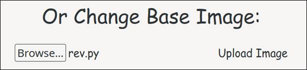

# Imageception
Flask Powered Vulnerable Image Generator

## Features
### Generate Text-Embedded Image


### Change Base Image


## Installation
```
git clone https://github.com/WesleyWong420/Imageception.git
cd Imageception/
chmod +x build.sh
./build.sh
curl http://localhost:1005
```
## Potential Vulnerabilities
| Vulnerability            | Mitigation Measure         | Common Weakness Enumeration (CWE) |
|:------------------------:|:--------------------------:|:---------------------------------:|
| OS Command Injection     | Input Sanitization         | CWE-20, CWE-74, CWE-78            |
| Directory Trasversal     | Pathname Canonicalization  | CWE-20, CWE-22                    |
| Unrestricted File Upload | File Attributes Validation | CWE-434                           |

## Vulnerability Exploitation
### OS Command Injection


### Directory Traversal


### Unrestricted File Upload



## Secure Coding Concepts
